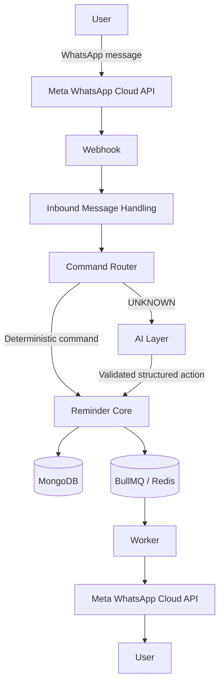
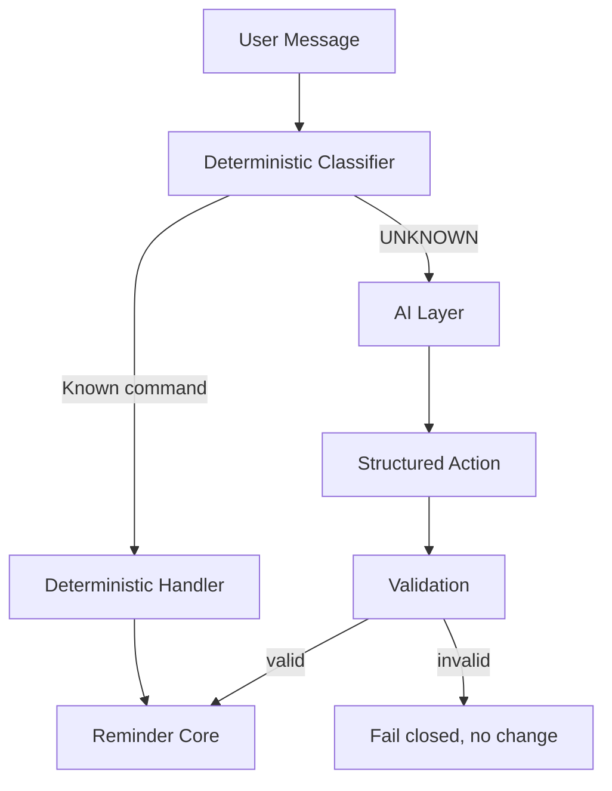

# PingMe

WhatsApp-first reminders with natural-language scheduling, recurring reminders, timezone-aware delivery, and AI-assisted reminder management.

PingMe is a reminder assistant that lives inside WhatsApp. Instead of asking users to open another app, it lets people create, manage, and receive reminders through messages they already send every day. Natural-language input is parsed into concrete reminders, scheduled and delivered by a deterministic core, with an AI layer reserved as a controlled fallback for natural phrasing the deterministic router does not recognize.

---

## ✨ Features

### Reminder Management

- **Natural-language creation**: `Remind me tomorrow at 8 PM to call Mom`
- **List reminders**: `Show my reminders` / `What reminders do I have?`
- **Temporal queries**: today, tomorrow, this week, next week, weekdays, and explicit dates
- **Edit reminders**: numbered edits, including time-only edits that preserve the task
- **Delete reminders**: cancel a single occurrence by number
- **Snooze reminders**: numbered (`snooze reminder 1 for 30 minutes`) and post-delivery (`snooze 30 minutes`)
- **Post-delivery actions**: `done`, `snooze 30 minutes`, `remind me again tomorrow`
- **Stop recurring reminders**: `stop reminder 1` stops the series; future occurrences are never created

### Recurring Reminders

Supported recurrence patterns: **daily**, **weekly**, **monthly**, and **specific weekdays** (Monday through Sunday), expressed as `every day`, `every week`, `every month`, or `every <weekday>`.

Recurring reminders are modeled as a chain of occurrences. When an occurrence is delivered, the next occurrence is scheduled. Stopping a series (`stop reminder N`) marks the occurrence so no successor is ever created, and is race-safe against a concurrently advancing worker.

### Natural Language

- Deterministic commands are always handled first, with a fixed precedence.
- AI is used **only** as a fallback for messages the deterministic router classifies as UNKNOWN.
- The AI layer returns a structured action that is strictly validated; it never accesses MongoDB or BullMQ directly.
- Reminder ownership, selection, scheduling, mutation, recurrence, and delivery remain server-authoritative.
- Malformed, unsupported, or unavailable AI responses fail closed: nothing is created or modified.

### Timezones

- Per-user IANA timezone (e.g. `Asia/Kolkata`, `America/New_York`), defaulting to `Asia/Kolkata`.
- Reminder creation resolves natural-language wall times in the user's timezone.
- Temporal queries (today, tomorrow, week, weekday, date) use the user's local calendar.
- Recurrence preserves local wall time across DST transitions.
- Delivery, confirmations, lists, and digests display times in the user's timezone.

### Morning Digest

- **Opt-in**: disabled by default; users enable it explicitly.
- Sent once per local calendar day during the **8:00 AM local time** window.
- Contains that day's upcoming pending reminders, formatted in the user's timezone.
- Duplicate prevention is enforced by an atomic per-day claim, so retries or restarts never send twice.

### WhatsApp

PingMe integrates with the **Meta WhatsApp Cloud API**: a webhook receives inbound messages and the outbound delivery path sends messages back through the Cloud API.

---

## 💬 Example Commands

| Category | Example |
|---|---|
| Create | `Remind me tomorrow at 8 PM to call Mom` |
| Create (recurring) | `Remind me every day at 9 AM to drink water` |
| Create (weekday) | `Remind me every Monday at 10 AM to standup` |
| List | `Show my reminders` / `What reminders do I have?` |
| Temporal query | `What do I have today?` / `What do I have tomorrow?` / `What do I have this week?` |
| Edit | `edit reminder 1 to call Dad tomorrow at 6 PM` |
| Edit time only | `edit reminder 1 to tomorrow at 5 PM` |
| Delete | `delete reminder 1` |
| Snooze | `snooze reminder 1 for 30 minutes` |
| Stop recurring | `stop reminder 1` |
| Post-delivery | `done` / `snooze 30 minutes` / `remind me again tomorrow` |
| Timezone | `set timezone America/New_York` |
| Digest | `enable digest` / `disable digest` |
| Help | `help` |

Natural-language examples handled through the AI fallback:

```text
Move my dentist reminder to Friday at 5 PM
Delete the reminder about Mom
What do I have tomorrow?
```

---

## 🧠 How It Works



Inbound messages are claimed idempotently by their unique WhatsApp message ID, the user is resolved, and the message is routed. Known commands execute deterministically; only UNKNOWN messages reach the AI layer, which returns a structured action that is validated before the deterministic reminder core acts on it. Scheduling happens through BullMQ with stable job identity, and a worker performs delivery, retries, recurrence advancement, and the digest scheduler.

---

## 🏗️ Architecture

### Webhook Layer

The Meta webhook (`GET`/`POST /api/webhook`) verifies the Meta handshake with a configured verify token and receives inbound messages. Each message is claimed atomically by its unique `wamid`, which makes duplicate webhook deliveries idempotent. Inbound messages progress through an explicit state machine (received, processing, processed, failed) with a 72-hour retention TTL.

### Command Router

A deterministic classifier maps messages to intents with a fixed precedence: post-delivery "remind me again", creation, numbered edit, numbered snooze, stop-recurring, settings, post-delivery done/snooze, numbered and bulk delete, list, today-list, digest, help, and finally UNKNOWN. Only UNKNOWN messages fall through to the AI layer.

### Reminder Service

The reminder service owns the core lifecycle: creation, listing, numbered selection, editing, cancellation, snooze, series-stop, and recurrence advancement. Every mutation is a user-scoped atomic state transition (for example, a pending-only conditional update), and scheduling always flows through BullMQ with a deterministic job ID equal to the reminder ID.

### MongoDB

Persistent documents:

- **Reminders** with status (`pending`, `sent`, `failed`, `cancelled`), delivery metadata, and recurrence fields (pattern, anchor day, parent/next links, stop marker).
- **Users** with canonical phone number, IANA timezone, digest preference, and last-digest-claimed date.
- **Inbound messages** used for webhook idempotency and state tracking.

### Redis / BullMQ

Delayed reminder jobs are scheduled on a BullMQ queue with deterministic `jobId = reminder._id`, 3 attempts, and exponential backoff. This guarantees stable job identity across edits, snoozes, and recovery.

### Worker

The worker runs in the same process as the server:

- Processes due reminder jobs and delivers via the WhatsApp Cloud API.
- Applies an already-delivered guard so a reminder is never sent twice.
- Advances recurring reminders after successful delivery.
- Runs periodic strand-recovery and digest-scheduler passes.

### AI Layer

The AI layer (Groq, OpenAI-compatible chat completions over HTTP) interprets UNKNOWN messages into one of a small set of structured actions: `create_reminder`, `edit_reminder`, `delete_reminder`, or `list_reminders`. Output is validated against strict key-exact schemas; any missing, extra, malformed, or unsupported field rejects the whole action. The AI layer has no database or queue access.

### Timezone Layer

User-facing temporal behavior resolves through the user's IANA timezone using the runtime's `Intl` support: wall-clock parsing, temporal range boundaries, recurrence schedules, and display formatting. DST transitions are handled by evaluating zone offsets at the target instant.

### Digest Scheduler

A periodic pass scans users with the digest enabled. When a user's local clock is inside the 8:00 AM window, the local calendar date is claimed atomically on the user document; only the winning claim sends the digest. This prevents duplicate digests across retries, restarts, and concurrent scheduler instances.

---

## 🔄 Recurring Reminders

Recurring reminders are a chain of occurrence documents. Delivering an occurrence creates and schedules the next one:

```text
Occurrence 1 ──> Occurrence 2 ──> Occurrence 3 ──> ...
```

- Each successor links back to its parent (`recurrenceParentId`) and inherits the pattern.
- `stop reminder N` marks the selected occurrence (`recurrenceStoppedAt`); `advanceRecurrence` refuses to create successors from it, and any successor already being created by a racing worker is flagged too.
- Recurrence schedules are interpreted in the user's timezone, so a daily 8:00 AM reminder stays 8:00 AM local across DST changes.
- Deleting, editing, or snoozing an occurrence affects only that occurrence, not the series.

---

## 🌎 Timezones & DST

Each user has an IANA timezone (default `Asia/Kolkata`), configurable with `set timezone <IANA>`.

- **Creation**: `Remind me tomorrow at 8 PM` resolves to 8 PM in the user's timezone as an absolute instant.
- **Temporal queries**: today, tomorrow, this week, next week, weekdays, and dates use the user's local calendar.
- **Recurrence**: local wall times are preserved across DST transitions (verified for zones such as `America/New_York`).
- **Display**: confirmations, lists, deliveries, and digests show the user's local time.

Changing timezone does not rewrite existing reminders; existing reminders keep their scheduled instants and future ones use the new timezone. The update response states this explicitly.

---

## ☀️ Morning Digest

- Disabled by default; enable with `enable digest`, disable with `disable digest`.
- Delivered during the 8:00 AM local-time window, once per local calendar day.
- Contains the day's upcoming pending reminders (delivered, cancelled, failed, and past reminders are excluded).
- Times are formatted in the user's timezone.
- An atomic per-day claim prevents duplicate digests even if the scheduler runs twice or the server restarts.

---

## 🛡️ Reliability & Safety

Concrete mechanisms implemented in the repository:

- **Inbound idempotency**: messages are claimed by unique `wamid`; duplicate webhook deliveries are skipped.
- **Stable job identity**: BullMQ jobs use `jobId = reminder._id`, so edits, snoozes, and recovery converge on one job.
- **Delivery retries**: 3 attempts with exponential backoff; permanent API errors fail fast.
- **Already-delivered guard**: a delivered reminder is never sent again, even on replay.
- **Worker crash recovery**: stranded (overdue, pending, undelivered) reminders are detected and re-scheduled with stale-safety windows and job-liveness checks.
- **Cancellation lifecycle**: only `pending` can become `cancelled`; sent and failed states are immutable; cancellation cannot race a worker into a bad state.
- **Hard deletion**: removal is authoritative; a deleted reminder can never be delivered.
- **Recurrence race protection**: series-stop is atomic and cascade-flagged, and `advanceRecurrence` re-checks the parent before returning any successor.
- **Atomic state transitions**: all mutations are conditional updates, not read-modify-write.
- **User scoping**: every selection and mutation is scoped to the authenticated user.
- **AI fail-closed**: invalid, malformed, or unavailable AI output produces no change.
- **Legacy API gating**: legacy/test HTTP endpoints return 404 unless explicitly enabled.

---

## 🔐 Security

- Reminder selection and mutation are always user-scoped; a user can never access another user's reminders.
- The production webhook is the only public endpoint; verification uses a configured Meta verify token.
- Legacy/test routes (`/api/reminders`, `/api/whatsapp/test`, `/api/messages`) are disabled by default and return 404 unless `ENABLE_LEGACY_API=true`.
- The AI layer cannot mutate persistence: it produces validated structured actions only.
- Secrets (WhatsApp token, verify token, Groq API token) are read from the environment and must never be committed.

---

## 🧰 Tech Stack

| Layer | Technology |
|---|---|
| Runtime | Node.js (ES modules) |
| Backend | Express |
| Database | MongoDB with Mongoose |
| Queue | BullMQ |
| Broker | Redis (ioredis) |
| Messaging | Meta WhatsApp Cloud API |
| Natural-language parsing | chrono-node |
| AI | Groq (OpenAI-compatible chat completions via axios) |
| Testing | Node.js built-in test runner (`node --test`) |

---

## 📁 Project Structure

```text
.
├── backend/
│   ├── src/
│   │   ├── routes/          # webhook, legacy (gated) routes
│   │   ├── services/        # reminder core, routing, AI, digest, delivery, users
│   │   ├── models/          # reminder, user, inbound-message
│   │   ├── utils/           # parser, recurrence, timezone, time ranges, formatting
│   │   ├── queues/          # BullMQ queue setup
│   │   ├── workers/         # delivery worker + recovery and digest ticks
│   │   ├── controllers/     # webhook and reminder controllers
│   │   ├── config/          # MongoDB and Redis connections
│   │   ├── app.js           # Express application
│   │   └── server.js        # entry point (imports the worker)
│   ├── tests/               # node:test suites
│   ├── scripts/             # phone migration scripts
│   ├── package.json
│   └── .env.example
└── docs/                    # design and API documentation
```

The server entry point imports the worker, so a single process runs the HTTP API, the BullMQ worker, and the periodic recovery/digest passes.

---

## 🚀 Getting Started

### Prerequisites

- Node.js
- MongoDB (running locally, or a reachable instance)
- Redis (running locally)
- A Meta WhatsApp Cloud API application (phone number ID, access token, verify token)
- Groq API credentials (required for the AI fallback; deterministic commands work without it)

### Installation

```bash
git clone <repository-url>
cd PingMe/backend
npm install
```

### Environment Variables

Copy `.env.example` to `.env` and fill in the values.

| Variable | Required | Description |
|---|---|---|
| `MONGO_URI` | Yes | MongoDB connection string |
| `PORT` | No | HTTP port (default `5000`) |
| `WHATSAPP_TOKEN` | Yes | Meta WhatsApp Cloud API access token |
| `WHATSAPP_PHONE_NUMBER_ID` | Yes | Meta WhatsApp Cloud API phone number ID |
| `WHATSAPP_VERIFY_TOKEN` | Yes | Token used for the Meta webhook handshake |
| `GROQ_API_TOKEN` | No | Groq API token for the AI fallback |
| `GROQ_MODEL` | No | Groq model (default `openai/gpt-oss-120b`) |
| `GROQ_BASE_URL` | No | Groq base URL (default `https://api.groq.com/openai/v1`) |
| `ENABLE_LEGACY_API` | No | Set `true` to enable legacy/test HTTP routes (default: disabled) |

Never commit real values. `.env` is gitignored.

### Running Locally

```bash
cd PingMe/backend
npm run dev
```

`npm run dev` runs `nodemon server.js`. The server starts the Express API and the worker together; no separate worker command is required. A valid health check is available at `GET /health`.

For a plain start without file watching:

```bash
node server.js
```

Phone-migration utilities:

```bash
npm run migrate:phones
npm run migrate:phones:dry-run
```

---

## 📱 WhatsApp Setup

1. Create or configure a Meta app and the WhatsApp Cloud API product.
2. Note the phone number ID and generate an access token.
3. Set `WHATSAPP_TOKEN`, `WHATSAPP_PHONE_NUMBER_ID`, and `WHATSAPP_VERIFY_TOKEN` in `.env`.
4. Start PingMe and expose it so Meta can reach the webhook (for local development, a tunnel is required).
5. In the Meta app, configure the webhook callback URL:

   ```text
   https://<your-public-host>/api/webhook
   ```

   and the verify token.
6. Send a WhatsApp message to the business number and confirm the webhook receives it.

---

## 🧪 Testing

```bash
cd PingMe/backend
npm test
```

`npm test` runs the full `node --test` suite. The suite covers the deterministic router, reminder lifecycle and recurrence, snooze and post-delivery actions, timezone and DST behavior, the morning digest and its idempotency, the AI contract validation and fallback boundary, webhook idempotency, and the security gating of legacy routes.

At the current baseline the repository contains **433 passing tests** (labeled as of Phase 17). Tests run against local MongoDB and Redis; the WhatsApp and Groq integrations are mocked in tests and the runtime harness.

---

## 🔌 API / Webhook Surface

| Route | Status | Purpose |
|---|---|---|
| `GET /api/webhook` | Public | Meta handshake verification |
| `POST /api/webhook` | Public | Receives inbound WhatsApp messages |
| `GET /health` | Public | Health check for MongoDB and Redis |

Legacy/test routes (`/api/reminders/*`, `/api/whatsapp/test`, `/api/messages/*`) exist only for historical compatibility and return `404` by default unless `ENABLE_LEGACY_API=true`.

---

## 🤖 AI Design



- Deterministic operations are always preferred.
- The AI layer handles only supported natural-language cases and returns structured actions.
- Actions are validated against strict key-exact schemas before any service call.
- The reminder services remain authoritative over persistence, ownership, and scheduling.
- Malformed, unsupported, or unavailable AI output fails closed with no state change.

---

## 🧭 Design Principles

- **Deterministic core**: a predictable command router and service layer are the source of truth.
- **Server-authoritative state**: ownership, selection, scheduling, and delivery are decided server-side.
- **User-scoped operations**: every query and mutation is bound to the resolved user.
- **Idempotency**: webhook duplicates and repeated operations converge on one effect.
- **Atomic state transitions**: conditional updates prevent race conditions.
- **Bounded AI interface**: the AI layer emits validated structured actions only.
- **Timezone-aware scheduling**: wall-clock semantics live in the user's timezone; instants are stored absolutely.
- **Explicit failure handling**: every failure path is defined, user-facing, and non-destructive.

---

## 📌 Current Status

PingMe is an implemented product providing a complete WhatsApp-first reminder workflow: reminder creation, management (list, edit, delete, snooze, stop-recurring), post-delivery actions, recurring reminders, timezone- and DST-aware scheduling, an opt-in morning digest, and AI-assisted natural-language commands, all backed by an idempotent, user-scoped deterministic core.

---

## 🤝 Contributing

1. Fork the repository.
2. Create a feature branch.
3. Make your changes.
4. Run the test suite (`npm test`).
5. Open a pull request.

---

## 📄 License

No license file is present in this repository.